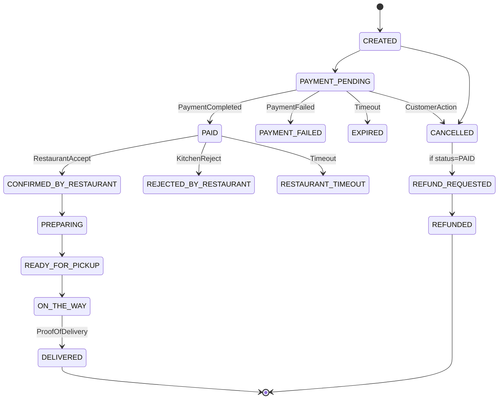

# Order Service

**Order Service**, sipariş yaşam döngüsünü yöneten, yüksek düzeyde tutarlılık ve ölçeklenebilirlik odaklı tasarlanmış bir mikroservistir. Sipariş oluşturma, durum yönetimi, ödeme ve restoran servisleri arasındaki koordinasyonu SAGA pattern kullanarak yönetir.

---

## 🏗 Mimari Yapı ve Prensipler

Bu servis **Domain-Driven Design (DDD)** ve **Hexagonal Architecture (Clean Architecture)** prensiplerine uygun olarak geliştirilmiştir.

### Kullanılan Patternler
*   **SAGA Pattern (Choreography):** Dağıtık transaction yönetimi için merkezi bir yönetici yerine olay tabanlı (event-driven) koordinasyon kullanılır.
*   **Transactional Outbox Pattern:** Veritabanı işlemi ve event yayınlamanın atomik olması sağlanır. Eventler önce veritabanına yazılır, ardından bir Relay Scheduler ile Kafka'ya iletilir.
*   **State Machine:** Karmaşık sipariş durum geçişleri (`CREATED` → `PAID` → `DELIVERED`) merkezi bir state machine üzerinden valide edilir.
*   **Idempotency:** Mükerrer isteklerin (double checkout vb.) işlenmesini engellemek için `idempotencyKey` mekanizması uygulanır.

---

## 🔄 Sipariş Durum Makinesi (State Machine)

Sipariş süreci aşağıdaki diyagramda belirtilen durum geçişlerini takip eder:



---

## 💾 Veri Modeli (Database Schema)

Sistemde 6 ana tablo bulunmaktadır. Veritabanı şemasına ait detaylı dökümantasyona [db_schema.html](./db_schema.html) dosyasından ulaşabilirsiniz.

*   **Orders:** Aggregate Root. Siparişin temel verilerini ve Value Object'lerini (Price, Address) tutar.
*   **Order_Items:** Siparişe ait kalemlerin fiyat snapshot'larını saklar.
*   **Carts / Cart_Items:** Kullanıcının aktif sepet verileri.
*   **Order_Status_History:** Durum değişikliklerinin audit logları.
*   **Outbox_Events:** Kafka'ya gönderilmeyi bekleyen olaylar.

---

## 🛠 Teknoloji Yığını

*   **Runtime:** Java 21 (Spring Boot 3.2.x)
*   **Database:** PostgreSQL 15 (Jakarta JPA / Hibernate)
*   **Messaging:** Apache Kafka (Spring Kafka)
*   **Security:** JWT based Authorization
*   **Documentation:** SpringDoc OpenAPI (Swagger)
*   **Observability:** Prometheus & Actuator

---

## 🚀 Başlangıç

### Portlar
*   **Order Service:** `8082`
*   **Swagger UI:** [http://localhost:8082/swagger-ui.html](http://localhost:8082/swagger-ui.html)
*   **Health:** [http://localhost:8082/actuator/health](http://localhost/8082/actuator/health)

### Çalıştırma
```bash
docker-compose up -d
```
